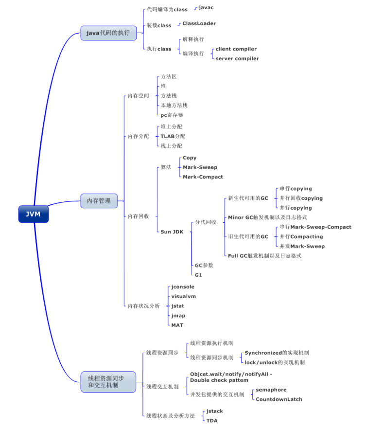
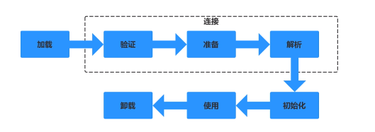
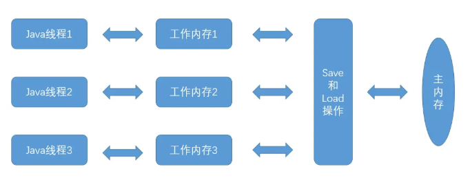

## 类的生命周期



> 编写的java代码会通过编译器编译成字节编码的.class文件，再把字节编码加载到JVM中，映射到内存的各个区域中，程序就可以在内存中运行了。
>
> 类加载流程：
>
> 加载-->验证-->准备-->解析-->初始化-->使用-->卸载
>
> ```
> 类从被加载到JVM中开始，到卸载为止，整个生命周期包括：加载、验证、准备、解析、初始化、使用和卸载七个阶段。
> 
> 其中类加载过程包括加载、验证、准备、解析和初始化五个阶段。
> ```

## 类加载 机制

## 简述 java 类加载机制?

> 虚拟机把描述类的数据从 Class 文件加载到内存，并对数据进行校验，解析和初始化，最终形成可以被虚拟机直接使用的 java 类型。

## 什么是类加载器，类加载器有哪些?

> 实现通过类的权限定名获取该类的二进制字节流的代码块叫做类加载器。
> 主要有一下四种类加载器:
>
> 1. 启动类加载器(Bootstrap ClassLoader)用来加载 java 核心类库，无法被 java 程序直接引用。
> 2. 扩展类加载器(extensions class loader):它用来加载 Java 的扩展库。Java 虚拟机的实现会提供一个扩展库目录。该类加载器在此目录里面查找并加载 Java 类。
> 3. 系统类加载器（system class loader）：它根据 Java 应用的类路径（CLASSPATH）来加载 Java 类。一般来说，Java 应用的类都是由它来完成加载的。可以通过ClassLoader.getSystemClassLoader()来获取它。
> 4. 用户自定义类加载器，通过继承 java.lang.ClassLoader 类的方式实现。

## 什么是双亲委派机制？介绍一些运作过程，双亲委派模型的好处；

> 双亲委托模型，约定类加载器的加载机制
> 双亲委托模型的工作过程是：如果一个类加载器收到了类加载的请求，它首先不会自己去尝试加载这个类，而是把这个请求委托给父类加载器去完成，每一个层次的类加载器都是如此，因此所有的加载请求最终都应该传送到顶层的启动类加载器中，只有当父类加载器反馈自己无法完成这个加载请求（它的搜索范围中没有找到所需要加载的类）时，子加载器才会尝试自己去加载。

> ```
> **使用双亲委托机制的好处是**：能够有效确保一个类的全局唯一性，当程序中出现多个限定名相同的类时，类加载器在执行加载时，始终只会加载其中的某一个类。
> 
> 使用双亲委托模型来组织类加载器之间的关系，有一个显而易见的好处就是Java类随着它的类加载器一起具备了一种带有优先级的层次关系。例如类java.lang.Object，它存放在rt.jar之中，无论哪一个类加载器要加载这个类，最终都是委托给处于模型最顶端的启动类加载器进行加载，因此Object类在程序的各种加载器环境中都是同一个类。相反，如果没有使用双亲委托模型，由各个类加载器自行去加载的话，如果用户自己编写了一个称为java.lang.Object的类，并放在程序的ClassPath中，那系统中将会出现多个不同的Object类，Java类型体系中最基础的行为也就无法保证，应用程序也将会变得一片混乱。如果自己去编写一个与rt.jar类库中已有类重名的Java类，将会发现可以正常编译，但永远无法被加载运行。
> 
> 
> 双亲委托模型对于保证Java程序的稳定运作很重要，但它的实现却非常简单，实现双亲委托的代码都集中在java.lang.ClassLoader的loadClass()方法中，逻辑清晰易懂：先检查是否已经被加载过，若没有加载则调用父类加载器的loadClass()方法，若父加载器为空则默认使用启动类加载器作为父加载器。如果父类加载器加载失败，抛出ClassNotFoundException异常后，再调用自己的findClass方法进行加载。
> ```


## 什么情况下我们需要破坏双亲委派模型；

> JNDI,JDBC,JCE,JAXB和JBI         
>
> tomcat 部署多个war包，不同war包有同名的类，需要打破双亲委派机制

## JVM内存模型

> http://www.importnew.com/31126.html
>
> Java代码是运行在Java虚拟机(JVM)上的，Java虚拟机通过解释执行（解释器）或编译执行（编译器）来完成。
>
> 
>
> Java内存模型分为:  方法区（Method Area）（包含常量池），Java堆（Heap）   (统称堆区，共有数据)
>
> ​                                Java栈（VM Stack），本地方法栈（Native Method Stack），程序计数器（PC 寄存器）                                 （统称栈区，私有数据）
>
> 
>
> **方法区：**方法区是各个线程共享的区域，包含**运行时常量池**，存放类信息，常量，静态常量，编译器编译后的代码等信息。
>
> **Java堆：**Java堆也是线程共享区域，类的实例存放在这里，一个系统会产生很多Java实例，因此Java堆的空间		是最大的，如果Java堆的空间不足，就会抛出OutOfMemoryError异常。(写出代码实现OOM)
>
> **Java栈：**线程私有区域，生命周期与线程相同，一个线程对应一个Java栈，每执行一个方法就会向栈里压一个元素，这个元素叫“栈帧”，栈帧中包含了方法中保存了该方法调用的参数、局部变量和返回地址等信息，如果栈空间不足了就会抛出StackOverflowError异常。Java 虚拟机栈会出现两种异常：StackOverFlowError 和 OutOfMemoryError。
>
> - StackOverFlowError： 若Java虚拟机栈的内存大小不允许动态扩展，那么当线程请求栈的深度超过当前Java虚拟机栈的最大深度的时候，就抛出StackOverFlowError异常。
> - OutOfMemoryError： 若 Java 虚拟机栈的内存大小允许动态扩展，且当线程请求栈时内存用完了，无法再动态扩展了，此时抛出OutOfMemoryError异常。
>
> **本地方法栈：**和Java栈类似，本地方法栈是用来执行本地方法的（由其他语言（如C、C++ 或其他汇编语言）编写，编译成和处理器相关的代码），存放的方法调用本地方法接口，最终调用本地方法库，实现与操作系统，硬件交互的目的。
>
> **程序计数器：** 记录当前线程执行的行号，可以看作是当前线程所执行的字节码的行号指示器。这里对应的类以及加载，实例对象，方法，静态变量去了该去的地方，那么问题来了，程序该怎么执行，哪个方法先执行，哪个方法后执行，这些指令执行的顺序就是PC寄存器在管，它的作用就是控制程序指令的执行顺序。

## JVM内存模型

~~~
程序计数器
程序计数器里面记录的是当前线程正在执行的那一条字节码指令的地址。 (如果当前线程正在执行的是一个本地方法，那么此时程序计数器为空)

作用：
(1)字节码解释器通过改变程序计数器来依次读取指令，从而实现代码的流程控制，如：顺序执行、选择、循环、异常处理。
(2)在多线程的情况下，程序计数器用于记录当前线程执行的位置，从而当线程被切换回来的时候能够知道该线程上次运行到哪儿了。 

特点：
(1)是一块较小的存储空间
(2)线程私有。每条线程都有一个程序计数器。
(3)是唯一一个不会出现OutOfMemoryError的内存区域。
(4)生命周期随着线程的创建而创建，随着线程的结束而死亡。 
~~~

~~~
本地方法栈
本地方法栈和Java虚拟机栈实现的功能类似，只不过本地方法区是本地方法运行的内存模型。
本地方法被执行的时候，在本地方法栈也会创建一个栈帧，用于存放该本地方法的局部变量表、操作数栈、动态链接、出口信息。
方法执行完毕后相应的栈帧也会出栈并释放内存空间。
也会抛出StackOverFlowError和OutOfMemoryError异常。
~~~

~~~
java虚拟机栈
Java虚拟机栈是描述Java方法运行过程的内存模型。 
Java虚拟机栈会为每一个即将运行的Java方法创建一块叫做“栈帧”的区域，这块区域用于存储该方法在运行过程中所需要的一些信息，这些信息包括：
(1) 局部变量表 (存放基本数据类型变量、引用类型的变量、returnAddress类型的变量)
(2) 操作数栈
(3) 动态链接
(4) 方法出口信息

特点：
(1) 局部变量表的创建是在方法被执行的时候，随着栈帧的创建而创建。而且，局部变量表的大小在编译时期就确定下来了，在创建的时候只需分配事先规定好的大小即可。此外，在方法运行的过程中局部变量表的大小是不会发生改变的。
(2) Java虚拟机栈会出现两种异常：StackOverFlowError和OutOfMemoryError。 
	a) StackOverFlowError： 
	   若Java虚拟机栈的内存大小不允许动态扩展，那么当线程请求栈的深度超过当前Java虚拟机栈的最大深度的时候，就抛出StackOverFlowError异常。 
	b) OutOfMemoryError： 
	   若Java虚拟机栈的内存大小允许动态扩展，且当线程请求栈时内存用完了，无法再动态扩展了，此时抛出OutOfMemoryError异常。
(3) Java虚拟机栈也是线程私有的，每个线程都有各自的Java虚拟机栈，而且随着线程的创建而创建，随着线程的死亡而死亡。

StackOverFlowError表示当前线程申请的栈超过了事先定好的栈的最大深度，但内存空间可能还有很多。 
而OutOfMemoryError是指当线程申请栈时发现栈已经满了，而且内存也全都用光了。 
~~~

~~~
堆
特点：
(1) 线程共享 (整个Java虚拟机只有一个堆，所有的线程都访问同一个堆。而程序计数器、Java虚拟机栈、本地方法栈都是一个线程对应一个的)
(2) 在虚拟机启动时创建
(3) 垃圾回收的主要场所。
(4) 可以进一步细分为：新生代、老年代。 
	新生代又可被分为：Eden、From Survior、To Survior。 
	不同的区域存放具有不同生命周期的对象。这样可以根据不同的区域使用不同的垃圾回收算法，从而更具有针对性，从而更高效。
(5) 堆的大小既可以固定也可以扩展，但主流的虚拟机堆的大小是可扩展的，因此当线程请求分配内存，但堆已满，且内存已满无法再扩展时，就抛出OutOfMemoryError。 
~~~

~~~
方法区

Java虚拟机规范中定义方法区是堆的一个逻辑部分。 
方法区中存放已经被虚拟机加载的类信息、常量、静态变量、即时编译器编译后的代码等。 

特点：
(1) 线程共享 (方法区是堆的一个逻辑部分，因此和堆一样，都是线程共享的。整个虚拟机中只有一个方法区)
(2) 永久代 (方法区中的信息一般需要长期存在，而且它又是堆的逻辑分区，因此用堆的划分方法，我们把方法区称为老年代)
(3) 内存回收效率低 
	方法区中的信息一般需要长期存在，回收一遍内存之后可能只有少量信息无效。 
	对方法区的内存回收的主要目标是：对常量池的回收 和 对类型的卸载。
(4) Java虚拟机规范对方法区的要求比较宽松。 
	和堆一样，允许固定大小，也允许可扩展的大小，还允许不实现垃圾回收。 
	
什么是运行时常量池？
方法区中存放三种数据：类信息、常量、静态变量、即时编译器编译后的代码。其中常量存储在运行时常量池中。

我们一般在一个类中通过public static final来声明一个常量。这个类被编译后便生成Class文件，这个类的所有信息都存储在这个class文件中。

当这个类被Java虚拟机加载后，class文件中的常量就存放在方法区的运行时常量池中。而且在运行期间，可以向常量池中添加新的常量。如：String类的intern()方法就能在运行期间向常量池中添加字符串常量。

当运行时常量池中的某些常量没有被对象引用，同时也没有被变量引用，那么就需要垃圾收集器回收。 
~~~

~~~
(1) Java虚拟机的内存模型中一共有两个“栈”，分别是：Java虚拟机栈和本地方法栈。 
两个“栈”的功能类似，都是方法运行过程的内存模型。并且两个“栈”内部构造相同，都是线程私有。 
只不过Java虚拟机栈描述的是Java方法运行过程的内存模型，而本地方法栈是描述Java本地方法运行过程的内存模型。
(2) Java虚拟机的内存模型中一共有两个“堆”，一个是原本的堆，一个是方法区。方法区本质上是属于堆的一个逻辑部分。堆中存放对象，方法区中存放类信息、常量、静态变量、即时编译器编译的代码。
(3) 堆是Java虚拟机中最大的一块内存区域，也是垃圾收集器主要的工作区域。
(4) 程序计数器、Java虚拟机栈、本地方法栈是线程私有的，即每个线程都拥有各自的程序计数器、Java虚拟机栈、本地方法区。并且他们的生命周期和所属的线程一样。 
而堆、方法区是线程共享的，在Java虚拟机中只有一个堆、一个方法栈。并在JVM启动的时候就创建，JVM停止才销毁。
~~~


## JVM虚拟机内存划分、类加载器、垃圾收集算法、垃圾收集器、class文件结构是如何解析的；

> class文件
>
> CA FE BA BE（magic魔数）
>
> https://blog.csdn.net/qq_26222859/article/details/73135660
>
> 方法区里存储着class文件的信息和运行时常量池,class文件的信息包括类信息和class文件常量池。
>
> 运行时常量池里的内容除了是class文件常量池里的内容外，还将class文件常量池里的符号引用转变为直接引用，而且运行时常量池里的内容是能动态添加的。例如调用String的intern方法就能将string的值添加到String常量池中，这里String常量池是包含在运行时常量池里的，但在jdk1.8后，将String常量池放到了堆中。
>
> 在Class文件结构中，最头的4个字节用于存储魔数Magic Number，用于确定一个文件是否能被JVM接受，再接着4个字节用于存储版本号，前2个字节存储次版本号，后2个存储主版本号，再接着是用于存放常量的常量池，由于常量的数量是不固定的，所以常量池的入口放置一个U2类型的数据(constant_pool_count)存储常量池容量计数值。
> 常量池主要用于存放两大类常量：**字面量**(Literal)和**符号引用量**(Symbolic References)，字面量相当于Java语言层面常量的概念，如文本字符串，声明为final的常量值等，符号引用则属于编译原理方面的概念，包括了如下三种类型的常量：
>
> - 类和接口的全限定名
> - 字段名称和描述符
> - 方法名称和描述符
>
> CLass文件中除了有类的版本、字段、方法、接口等描述信息外，还有一项信息是常量池，用于存放编译期生成的各种字面量和符号引用，这部分内容将在类加载后进入方法区的运行时常量池中存放。


## 堆里面的分区：Eden，survival （from+ to），老年代，各自的特点

> 堆里面分为新生代和老生代（java8 取消了永久代，采用了 Metaspace），
>
> 新生代包含 Eden+Survivor 区，survivor 区里面分为 from 和 to 区，内存回收时，如果用的是复制算法，从 from 复制到 to，当经过一次或者多次 GC 之后，存活下来的对象会被移动到老年区，当 JVM 内存不够用的时候，会触发 Full GC，清理 JVM 老年区当新生区满了之后会触发 YGC,先把存活的对象放到其中一个 Survice区，然后进行垃圾清理。因为如果仅仅清理需要删除的对象，这样会导致内存碎片，因此一般会把 Eden 进行完全的清理，然后整理内存。那么下次 GC 的时候，就会使用下一个 Survive，这样循环使用。如果有特别大的对象，新生代放不下，就会使用老年代的担保，直接放到老年代里面。因为 JVM 认为，一般大对象的存活时间一般比较久远。


## GC分哪两种，Minor GC 和Full GC有什么区别？什么时候会触发Full GC？分别采用什么算法？

>​	次数上频繁收集Young区 （新生代）**Minor GC**
>
>​	次数上较少收集Old区 （老年代）     **Full GC**


## JVM垃圾收集器

~~~
Serial：最早的单线程串行垃圾回收器。

Serial Old：Serial 垃圾回收器的老年版本，同样也是单线程的，可以作为 CMS 垃圾回收器的备选预案。

ParNew：是 Serial 的多线程版本。

Parallel 和 ParNew 收集器类似是多线程的，但 Parallel 是吞吐量优先的收集器，可以牺牲等待时间换取系统的吞吐量。

Parallel Old 是 Parallel 老生代版本，Parallel 使用的是复制的内存回收算法，Parallel Old 使用的是标记-整理的内存回收算法。

CMS：一种以获得最短停顿时间为目标的收集器，非常适用 B/S 系统。

G1：一种兼顾吞吐量和停顿时间的 GC 实现，是 JDK 9 以后的默认 GC 选项。

~~~


### **CMS 垃圾回收器**

~~~
CMS 是英文 Concurrent Mark-Sweep 的简称，是以牺牲吞吐量为代价来获得最短回收停顿时间的垃圾回收器。对于要求服务器响应速度的应用上，这种垃圾回收器非常适合。在启动 JVM 的参数加上“-XX:+UseConcMarkSweepGC”来指定使用 CMS 垃圾回收器。

CMS 使用的是标记-清除的算法实现的，所以在 gc 的时候回产生大量的内存碎片，当剩余内存不能满足程序运行要求时，系统将会出现 Concurrent Mode Failure，临时 CMS 会采用 Serial Old 回收器进行垃圾清除，此时的性能将会被降低。
~~~


### 新生代垃圾回收器和老生代垃圾回收器都有哪些？有什么区别？

~~~
新生代回收器：Serial、ParNew、Parallel Scavenge

老年代回收器：Serial Old、Parallel Old、CMS

整堆回收器：G1

新生代垃圾回收器一般采用的是复制算法，复制算法的优点是效率高，缺点是内存利用率低；
老年代回收器一般采用的是标记-整理的算法进行垃圾回收。
~~~


### 分代垃圾回收器是怎么工作的？

~~~
分代回收器有两个分区：老生代和新生代，新生代默认的空间占比总空间的 1/3，老生代的默认占比是 2/3。

新生代使用的是复制算法，新生代里有 3 个分区：Eden、To Survivor、From Survivor，它们的默认占比是 8:1:1，它的执行流程如下：

把 Eden + From Survivor 存活的对象放入 To Survivor 区；

清空 Eden 和 From Survivor 分区；

From Survivor 和 To Survivor 分区交换，From Survivor 变 To Survivor，To Survivor 变 From Survivor。

每次在 From Survivor 到 To Survivor 移动时都存活的对象，年龄就 +1，当年龄到达 15（默认配置是 15）时，升级为老生代。大对象也会直接进入老生代。

老生代当空间占用到达某个值之后就会触发全局垃圾收回，一般使用标记整理的执行算法。以上这些循环往复就构成了整个分代垃圾回收的整体执行流程。
~~~


### 常用的 jvm 调优的参数都有哪些？

~~~
-Xms2g：初始化推大小为 2g；

-Xmx2g：堆最大内存为 2g；

-XX:NewRatio=4：设置年轻的和老年代的内存比例为 1:4；

-XX:SurvivorRatio=8：设置新生代 Eden 和 Survivor 比例为 8:2；

–XX:+UseParNewGC：指定使用 ParNew + Serial Old 垃圾回收器组合；

-XX:+UseParallelOldGC：指定使用 ParNew + ParNew Old 垃圾回收器组合；

-XX:+UseConcMarkSweepGC：指定使用 CMS + Serial Old 垃圾回收器组合；

-XX:+PrintGC：开启打印 gc 信息；

-XX:+PrintGCDetails：打印 gc 详细信息。
~~~


### SafePoint 是什么

> 比如 GC 的时候必须要等到 Java 线程都进入到 safepoint 的时候 VMThread 才能开始执行 GC

> 1. 循环的末尾 (防止大循环的时候一直不进入 safepoint，而其他线程在等待它进入safepoint)
> 2. 方法返回前
> 3. 调用方法的 call 之后
> 4. 抛出异常的位置


### GC 的两种判定方法：

> **引用计数法：**指的是如果某个地方引用了这个对象就+1，如果失效了就-1，当为 0 就会回收但是 JVM 没有用这种方式，因为无法判定相互循环引用（A 引用 B,B 引用 A）的情况
>
> **引用链法(可达性算法)：** 通过一种 GC ROOT 的对象（方法区中静态变量引用的对象等-static 变量）来判断，如果有一条链能够到达 GC ROOT 就说明，不能到达 GC ROOT 就说明可以回收

### GC 收集器有哪些？CMS 收集器与 G1 收集器的特点。

> 并行收集器：串行收集器使用一个单独的线程进行收集，GC 时服务有停顿时间
> 串行收集器：次要回收中使用多线程来执行
> CMS 收集器是基于“ 标记— 清除”算法实现的，经过多次标记才会被清除
> G1 从 整体来看是基于“ 标记— 整理”算法实现的收集器，从 局部（两个 Region  之间）
> 上来看是基于“ 复制”算法实现的


### Minor GC 与 Full GC 分别在什么时候发生？

> 新生代内存不够用时候发生 MGC 也叫 YGC，JVM 内存不够的时候发生 FGC


## 简述 java 垃圾回收机制?

> 在 java 中，程序员是不需要显示的去释放一个对象的内存的，而是由虚拟机自行执行。在JVM 中，有一个垃圾回收线程，它是低优先级的，在正常情况下是不会执行的，只有在虚拟机空闲或者当前堆内存不足时，才会触发执行，扫面那些没有被任何引用的对象，并将它们添加到要回收的集合中，进行回收。


## java 中垃圾收集的方法有哪些?

> 1. 标记-清除:
>           这是垃圾收集算法中最基础的，根据名字就可以知道，它的思想就是标记哪些要被回收的对象，然后统一回收。
>    
>    这种方法很简单，但是会有两个主要问题：
>    
>    1.效率不高，标记和清除的效率都很低；
>    
>    2.会产生大量不连续的内存碎片，导致以后程序在分配较大的对象时，由于没有充足的连续内存而提前触发一次 GC 动作。
>    
> 2. 复制算法:
>           为了解决效率问题，复制算法将可用内存按容量划分为相等的两部分，然后每次只  使用其中的一块，当一块内存用完时，就将还存活的对象复制到第二块内存上，然  后一次性清楚完第一块内存，再将第二块上的对象复制到第一块。但是这种方式，  内存的代价太高，每次基本上都要浪费一般的内存。 
> 
>    ​       于是将该算法进行了改进，内存区域不再是按照 1：1 去划分，而是将内存划分为  8:1:1 三部分，较大那份内存交 Eden 区，其余是两块较小的内存区叫 Survior 区。 每次都会优先使用 Eden 区，若 Eden 区满，就将对象复制到第二块内存区上，然后清除 Eden 区，如果此时存活的对象太多，以至于 Survivor 不够时，会将这些对象通过分配担保机制复制到老年代中。(java 堆又分为新生代和老年代)
> 
> 3. 标记-整理
>           该算法主要是为了解决标记-清除，产生大量内存碎片的问题；当对象存活率较高时，也解决了复制算法的效率问题。它的不同之处就是在清除对象的时候现将可回  收对象移动到一端，然后清除掉端边界以外的对象，这样就不会产生内存碎片了。
> 
> 4. 分代收集
>            现在的虚拟机垃圾收集大多采用这种方式，它根据对象的生存周期，将堆分为新生  代和老年代。在新生代中，由于对象生存期短，每次回收都会有大量对象死去，那么这时就采用复制算法。老年代里的对象存活率较高，没有额外的空间进行分配担保，所以可以使用标记-整理 或者 标记-清除。


## 几种常用的内存调试工具：jmap、jstack、jconsole、jhat

jstack 可以看当前栈的情况，jmap 查看内存，jhat 进行 dump 堆的信息mat（eclipse 的也要了解一下）


## jvm优化经历

~~~
JDK自带的工具
jconsole：用于对 JVM 中的内存、线程和类等进行监控；主要用于对 Java 应用程序做性能分析和调优。
jvisualvm：JDK 自带的全能分析工具，可以分析：内存快照、线程快照、程序死锁、监控内存的变化、gc 变化等。

通过JVM 参数获取 dump 文件
 -XX:+HeapDumpOnOutOfMemoryError
当OutOfMemoryError发生时自动生成 Heap Dump 文件
-XX:+HeapDumpOnCtrlBreak 
交互式获取dump。在控制台按下快捷键Ctrl + Break时，JVM就会转存一下堆快照。
-XX:+HeapDumpBeforeFullGC 
当 JVM 执行 FullGC 前执行 dump。Full GC 是清理整个堆空间—包括年轻代和永久代。
-XX:+HeapDumpAfterFullGC
当 JVM 执行 FullGC 后执行 dump
-XX:HeapDumpPath=E:\java-heap\claim\heapdump${current_date}.hprof
指定 dump 文件存储路径。
注意：JVM 生成 Heap Dump 的时候，虚拟机是暂停一切服务的。
分析dump文件工具：
  eclipse插件Memory Analyzer Tool
~~~


## java 内存模型

> java 内存模型(JMM)是线程间通信的控制机制.JMM 定义了主内存和线程之间抽象关系。线程之间的共享变量存储在主内存（main memory）中，每个线程都有一个私有的本地内存（local memory），本地内存中存储了该线程以读/写共享变量的副本。本地内存是JMM 的一个抽象概念，并不真实存在。它涵盖了缓存，写缓冲区，寄存器以及其他的硬
> 件和编译器优化。Java 内存模型的抽象示意图如下：



从上图来看，线程 A 与线程 B 之间如要通信的话，必须要经历下面 2 个步骤：

1. 首先，线程 A 把本地内存 A 中更新过的共享变量刷新到主内存中去。
2. 然后，线程 B 到主内存中去读取线程 A 之前已更新过的共享变量。