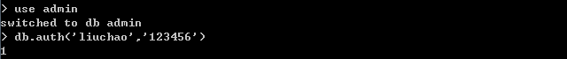

## Docker安装mongodb

### 下载镜像

```shell
docker pull registry.docker-cn.com/library/mongo
```

### 创建本地数据文件夹

```shell
mkdir /data/mongodb0
```

### 启动MongoDB容器

```shell
docker run --name mongodb-server -v /data/mongodb0:/data/db -p 27017:27017 -d 镜像ID --auth
```

- -v后面的参数表示把数据文件挂载到宿主机的路径
- -p把mongo端口映射到宿主机的指定端口
- --auth表示连接mongodb需要授权

### 为MongoDB添加管理员用户

- 进入MongoDB控制台

```shell
docker exec -it mongodb-server mongo admin
```


- 添加用户命令

```shell
db.createUser({ user: 'micheal', pwd: 'mingkai13', roles: [{role: "userAdminAnyDatabase", db: "admin"}]});

use storage
db.createUser({ user: 'micheal.wang', pwd: 'mingkai13', roles: [{role: "readWrite", db: "storage"}]});
// 需要切换对应db再创建user
```


### MongoDB用户权限

#### 内建的角色

1. 数据库用户角色：read、readWrite;
2. 数据库管理角色：dbAdmin、dbOwner、userAdmin；
3. 集群管理角色：clusterAdmin、clusterManager、clusterMonitor、hostManager；
4. 备份恢复角色：backup、restore；
5. 所有数据库角色：readAnyDatabase、readWriteAnyDatabase、userAdminAnyDatabase、dbAdminAnyDatabase
6. 超级用户角色：root // 这里还有几个角色间接或直接提供了系统超级用户的访问（dbOwner 、userAdmin、userAdminAnyDatabase）
7. 内部角色：__system

> 角色说明：
> **Read**：允许用户读取指定数据库
> **readWrite**：允许用户读写指定数据库
> **dbAdmin**：允许用户在指定数据库中执行管理函数，如索引创建、删除，查看统计或访问system.profile
> **userAdmin**：允许用户向system.users集合写入，可以找指定数据库里创建、删除和管理用户
> **clusterAdmin**：只在admin数据库中可用，赋予用户所有分片和复制集相关函数的管理权限。
> **readAnyDatabase**：只在admin数据库中可用，赋予用户所有数据库的读权限
> **readWriteAnyDatabase**：只在admin数据库中可用，赋予用户所有数据库的读写权限
> **userAdminAnyDatabase**：只在admin数据库中可用，赋予用户所有数据库的userAdmin权限
> **dbAdminAnyDatabase**：只在admin数据库中可用，赋予用户所有数据库的dbAdmin权限。
> **root**：只在admin数据库中可用。超级账号，超级权限

### 副本集形式部署

如果你想单点连接，那么从这里往下不需要看了，如果你想搭建MongoDB副本集，那么请移除MongoDB的所有docker容器，重新按照下面的方式启动容器和设置

#### 0. 创建用于auth的keyfile

```shell
mkdir -p /data/mongodb0_conf
cd /data/mongodb0_conf
openssl rand -base64 741 > mongodb-keyfile
chmod 600 mongodb-keyfile
chown 999 mongodb_keyfile
```

#### 1. 启动三个mongodb进程

```shell
docker run --name mongodb-server0 \
--restart always \
-v /data/mongodb0:/data/db \
-v /data/mongodb0_conf:/opt/keyfile \
-p 27017:27017 \
-d d22 \
--smallfiles \
--keyFile /opt/keyfile/mongodb-keyfile \
--replSet exuehui-mongo-set

docker run --name mongodb-server1 \
--restart always \
-v /data/mongodb1:/data/db \
-v /data/mongodb1_conf:/opt/keyfile \
-p 27018:27017 \
-d d22 \
--smallfiles \
--keyFile /opt/keyfile/mongodb-keyfile \
--replSet exuehui-mongo-set

docker run --name mongodb-server0 \
--restart always \
-v /data/mongodb0:/data/db \
-v /data/mongodb0_conf:/opt/keyfile \
-p 37017:27017 \
-d d22 \
--smallfiles \
--keyFile /opt/keyfile/mongodb-keyfile \
--replSet exuehui-mongo-set
```

#### 2 进入 mongodb docker

```shell
docker run -it --name mongo-client mongo /bin/bash
```

#### 3 进入要作为master数据库的 mongodb shell

```shell
mongo 192.168.31.206:27017/admin
```

#### 4 初始化副本集, _id和启动时设置的replSet参数相同

```shell
rs.initiate({ _id:"exuehui-mongo-set", members:[
{_id:0,host:"home.lemonsoft.vip:27017"}, {_id:1,host:"home.lemonsoft.vip:27018"}, {_id:2,host:"home.lemonsoft.vip:37017"}
]})
```

#### 5 查看副本集状态

```shell
rs.status()
```

#### 6.创建权限用户

```shell
use admin;
db.createUser({ user: '1iURI', pwd: 'rootroot', roles: [ { role: "userAdminAnyDatabase", db: "admin" } ] });

use exuehui
db.createUser({ user: '1iURI-exuehui', pwd: 'rootroot', roles: [ { role: "readWrite", db: "exuehui" } ] });
```

#### 7. 重新运行容器，并添加--auth

```shell
docker run --name mongodb-server0 \
--restart always \
-v /data/mongodb0:/data/db \
-v /data/mongodb0_conf:/opt/keyfile \
-p 27017:27017 \
-d d22 \
--smallfiles \
--keyFile /opt/keyfile/mongodb-keyfile \
--auth \
--replSet exuehui-mongo-set

docker run --name mongodb-server1 \
--restart always \
-v /data/mongodb1:/data/db \
-v /data/mongodb1_conf:/opt/keyfile \
-p 27018:27017 \
-d d22 \
--smallfiles \
--keyFile /opt/keyfile/mongodb-keyfile \
--auth \
--replSet exuehui-mongo-set

docker run --name mongodb-server0 \
--restart always \
-v /data/mongodb0:/data/db \
-v /data/mongodb0_conf:/opt/keyfile \
-p 37017:27017 \
-d d22 \
--smallfiles \
--keyFile /opt/keyfile/mongodb-keyfile \
--auth \
--replSet exuehui-mongo-set
```


## MongoDB使用命令创建用户权错误分析


**解决方案：先使用超级管理员登录**

  									

**再进行其他数据库用户创建的创建**


## MongoDB数据备份及还原

### 连接到宿主机

```
docker exec -it mongodb-server /bin/bash
```

### 使用mongodump进行数据库备份

**容器中执行**

```
mongodump -h 127.0.0.1 --port 27017 -u micheal.wang -p mingkai13 -d storage -o /data
```

| 参数   | 作用               |
| ------ | ------------------ |
| -h     | host               |
| --port | 端口               |
| -d     | 指定数据库         |
| -o     | 指定备份到具体目录 |
| -u     | 用户名             |
| -p     | 密码               |

### 压缩备份文件夹

```
tar -zcvf storage.tar.gz storage/
```

### 将备份文件从容器中导出到宿主机

```
docker cp mongodb-server:/data/storage.tar.gz /data
```

### 解压文件

```
tar -zxvf  storage.tar.gz 
```

### 将文件从宿主机导入新的容器

```
docker cp storage/ c9f9be23f50b:/data/dump/storage
```

### 使用mongorestore进行数据还原

```
mongorestore -h 127.0.0.1:27017 -u micheal.wang -p mingkai13 -d storage /data/dump/storage/
```


