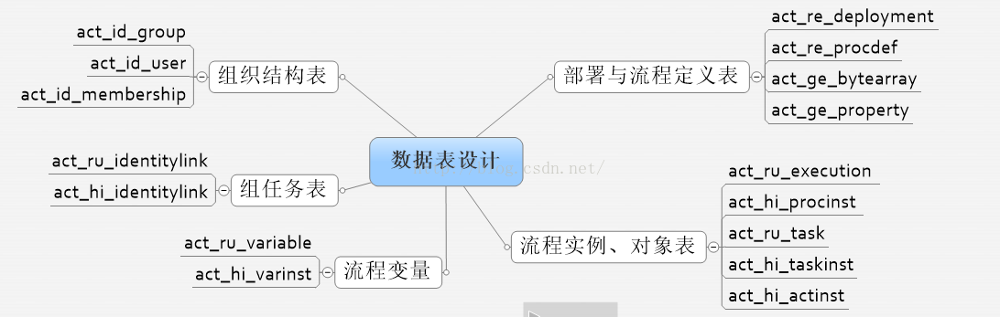

# Activiti5 工作流

## 准备工作：

activiti5 软件环境

1) JDK1.6或者更高版本

2) 数据库, mysql, oracle等

3) 支持activiti5运行的jar包  http://activiti.org/download.html

4) 开发工具intellij idea 

## **初始化数据库操作**

    public static void main(String[] args) throws Exception {
        ProcessEngineConfiguration configuration = ProcessEngineConfiguration.createStandaloneProcessEngineConfiguration();
        //定义连接mysql数据库
        configuration.setJdbcDriver("com.mysql.jdbc.Driver");
        configuration.setJdbcUrl("jdbc:mysql://localhost:3306/test2?         createDatabaseIfNotExist=true&useUnicode=true&characterEncoding=utf8");
        configuration.setJdbcUsername("root");
        configuration.setJdbcPassword("mysql@@123");
    
       /*  public static final String DB_SCHEMA_UPDATE_FALSE = "false";操作activiti23张表的时候，如果表不存在，就抛出异常，不能自动创建23张表
         public static final String DB_SCHEMA_UPDATE_CREATE_DROP = "create-drop";每次操作，都会先删除表，再创建表
         public static final String DB_SCHEMA_UPDATE_TRUE = "true";如果表不存在，就创建表，如果表存在，就直接操作        */
               configuration.setDatabaseSchemaUpdate(ProcessEngineConfiguration.DB_SCHEMA_UPDATE_TRUE);
        //activiti核心对象（流程引擎）
        ProcessEngine processEngine = configuration.buildProcessEngine();
        System.out.println("processEngine："+processEngine);
    }

## **数据库结构解析：**

Activiti自带的23张数据表

## **与部署对象和流程定义相关的表**

> act_ge_property：用来生成下一个主键信息
> 
> act_re_deployment：部署数据表，一次部署可以添加多个资源，资源会被保存到资源表（act_ge_bytearray）中；而部署的信息，则保存到部署表中。
> 
> act_re_procdef：流程定义表，如果发布部署的文件是流程文件，除了将内容保存到资源表外，还会解析流程文件的内容，形成特定的流程定义数据，保存到此表中。
> 
> act_ge_bytearray：资源表，用来保存资源相应的信息

## 与流程实例，执行对象，任务相关的表

> act_ru_execution：（下面的几个表都是以该表的id为外键关联）正在执行的流程实例表，当流程启动后，会产生一个流程实例，同时会产生相应的执行流，那么流程实例和执行流数据均会被保存到act_ru_execution表中。
> 
> act_hi_procinst：流程实例从开始到结束所经历的时间，与act_ru_execution对应。
> 
> act_hi_actinst：所有活动的历史表（包括所有的节点），与act_ru_execution对应。
> 
> act_ru_task：正在执行的任务列表（只有正在执行的任务，该表中才有数据），与act_ru_execution对应。

## **与流程变量相关的表**

> act_ru_variable： 正在执行的流程变量表，用来保存在整个流程执行过程中用到的变量信息
> 
> act_hi_varinst ：历史的流程变量表，与act_ru_variable正好对应

## 与组任务表相关的表

> act_ru_identitylink ：正在执行的组任务表 
> 
> act_hi_identitylink：历史的人员表

## 与组织结构相关的表

> act_id_group ：工作流中的角色表  
> 
> act_id_user ：工作流中的用户表  
> 
> act_id_membership：中间表，关联关系表